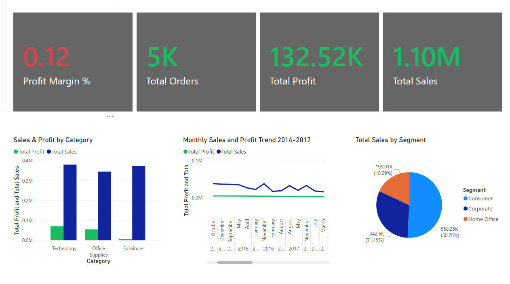
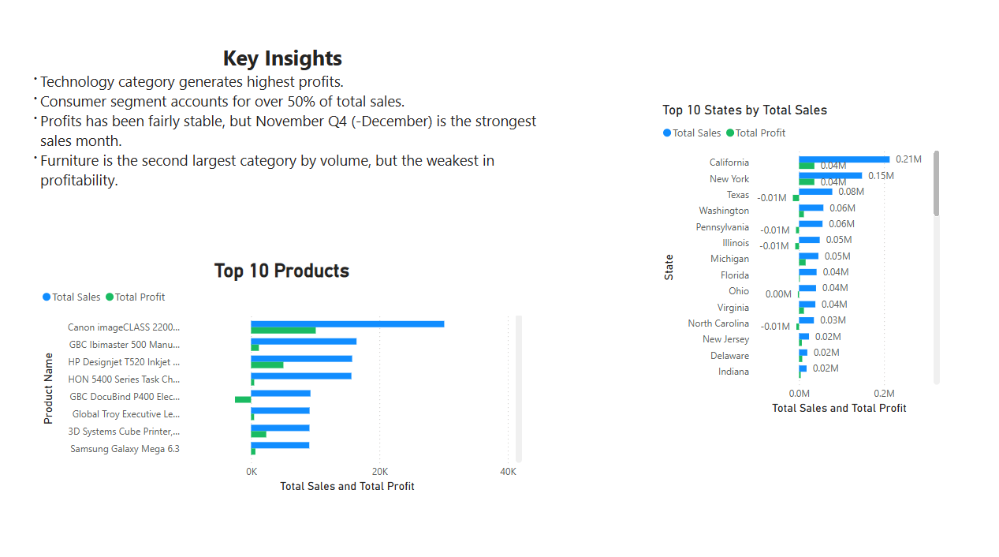
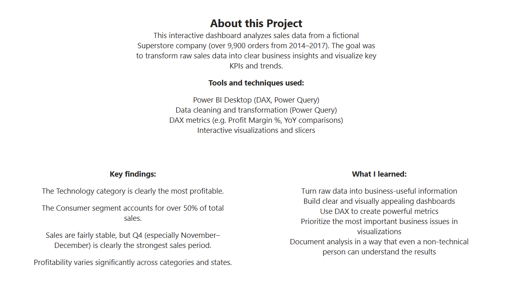

# Superstore Sales Performance Dashboard

Power BI + SQL analysis of a fictional Superstore retail chain (Kaggle's "Sample Superstore" dataset) — about 9,900 orders from 2014 to 2017.

## What this project does

I wanted to go past just making charts and actually pull out insights a retail business could use — where the profit's really coming from, which customers matter most, and what discounting is actually doing to the bottom line. I used SQL to dig into the numbers first, then built the dashboard in Power BI to make it visual.

## What I found

**1. Technology is the profit driver, not just a sales category.**
Technology generates the highest profit of all categories — worth knowing separately from *sales* volume, since a category can sell a lot and still not be the one making the money.

**2. Consumer segment is over half of all sales.**
The Consumer segment makes up more than 50% of total sales — so any change aimed at that segment moves the whole business more than changes aimed at Corporate or Home Office.

**3. Q4 is clearly the strongest period — real seasonality, not random spikes.**
Sales consistently peak in November–December. That's a pattern worth planning around (stock, staffing, marketing spend), not just something that happened to show up one year.

**4. Discounts are hurting profit, not just sales price.**
Bigger discounts show a clear negative relationship with profitability — so discounting is a lever that needs to be used carefully, not a default way to move product.

## Dashboard

## Tools used

- **Power BI** – dashboard, DAX measures, Power Query for shaping the data
- **SQL** – querying and calculating the underlying business metrics
- **DAX** – custom measures (profit margin, trends, etc.)

## SQL queries

Queries covering: total sales/profit/margin, top 10 products, category & state performance, monthly trends, customer segment breakdown, and discount-vs-profit impact.

**[See all SQL queries](./superstore_sales_analysis.sql)**

## What I learned

- How to go from raw transactional data to something a business person could actually act on, not just a chart
- Writing SQL specifically to answer business questions, not just to practice syntax
- Building DAX measures that mean something (profit margin, not just totals)
- That discounting has a real, measurable cost — not just a feel-good "sales tool"
